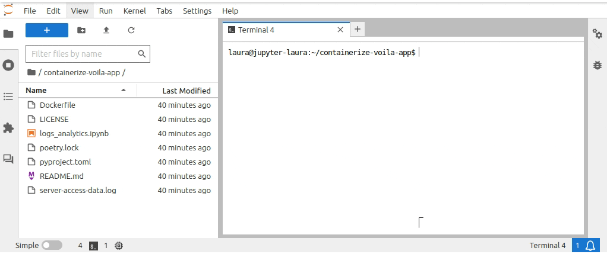

# Containerizing and deploying a Voilá app on AdaLab
This repository contains files that define a Voilá app (`access.log`, `poetry.lock`, `pyproject.toml`, and `logs_analytics.ipynb`) and a Containerfile (`Dockerfile`) that specifies the build steps to build a container image for the Voilá app.

In the following sections, we list the steps required to deploy a Voilá app as a containerized stand-alone app on [AdaLab](https://adamatics.com/index.php/platform-2/).

## Build the container image
First, open a terminal and make sure that the directory you are in is the cloned repository `containerize-voila-app`. Then, from the terminal, build the container image with the below command:

```docker build -t logs-analytics:1.0 .```

The argument `-t logs-analytics:1.0` specifies the name and tag to use for the built container image, and you can specify it as you wish. The only requirement is that a container image with this name does not already exist on your local computer, as this will cause an error, and that the name follows the [Open Container Initiative (OCI) naming convention](https://github.com/containers/image/blob/main/docker/reference/regexp.go). The build process will look as shown below if you have built this image before. Otherwise, there will be some more steps in which the various components need to be downloaded to the local compute resource.


<a href="graphics/build_docker_image.gif" target="_blank">
    
</a>

## Add metadata
Once the image building process is complete, you will have the container image available in your Lab on the AdaLab platform. One ways to view the container image file is with this command in a terminal, which can be executed from any location:

```docker images```

The next step is to add metadata to the container image, making it easier to find and manage. This also pushes the container image to a central storage location, making the app available for other users. You do this by heading to the Container Metadata page, as shown below:

<a href="graphics/add_metadata.gif" target="_blank">
    
</a>

Next, you simply wait a few minutes for the publishing process to complete. Click the **Refresh** button at the top of the Container Metadata page to check whether the publishing process finished. You can also watch the logs to follow along with the build process, or view them after the publishing process finished as shown below:


<a href="graphics/refresh_view_logs.gif" target="_blank">
    
</a>


## Deploy app
Once the Container Metadata publishing process finished successfully, an option to deploy the container image as an app will appear in the triple dot menu for the Container Metadata entry. Click this to open a dialog box in which you can fill in the details about the app, such as the name you want it to have in the URL the app will be available at. You can also specify other settings such as resource usage, environment variables, and the startup command. The **Strip Prefix** checkbox must be unchecked for the containerized Voilá app to deploy successfully, as shown below:

<a href="graphics/deploy_app.gif" target="_blank">
    
</a>

The argument you supplied in the start command in the Dockerfile for ```--Voila.base_url``` must match what you specify in the **App URL** field in the Deploy App dialog box:

<a href="graphics/deploy_app_dialog.png" target="_blank">
    
</a>

So, for the example in this repository where we pass ```"--Voila.base_url=/apps/logs-analytics/"``` in the startup command in the Dockerfile, we must specify "logs-analytics/" in the **App URL** field.

## Troubleshooting
This section describes how to fix various error scenarios.

### Running into the 404 page even after fixing bug
Try to clear cookies and site data in the browser for the AdaLab site, and then make sure you log back in before trying again.

### Unexpectedly receiving a 404 error
- Ensure the "**Strip Prefix** checkbox is unchecked under advanced settings in the "Deply app" dialog.
- Ensure the Voila.base_url parameter value ends with a "/", e.g. 
voila basics.ipynb --no-browser --port=8080 --Voila.ip=0.0.0.0 --Voila.base_url=/apps/a-basic-app/
- Check that the URL you deployed the app to matches the base_url argument you specified in the start command.
- Check that there is a trailing slash ("/") in the ```--Voila.base_url``` argument , as in the example Dockerfile in this repository: ```"--Voila.base_url=/apps/logs-analytics/"```.

### The Voila spinner appears, but remains at the last cell without rendering the app
Make sure that you specified the Voila.base_url parameter so the app and its contents are located in the expected location.